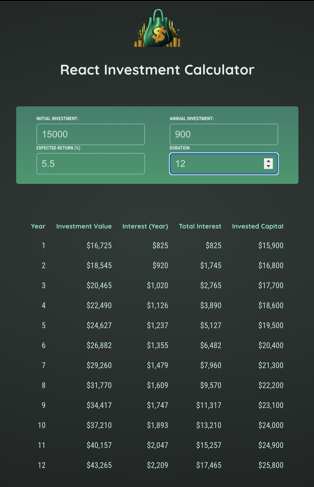

# 💰 React Investment Calculator

A simple React app that helps you calculate investment growth over time based on initial investment, annual contributions, expected return rate, and duration. It dynamically displays yearly breakdowns including interest earned, total interest, and invested capital.

## 📸 Screenshot



## 📂 Project Structure

React-Investment-Calculator
├── public/
│ ├── investment-calculator-logo.png
│ ├── Screenshot.png
├── src/
│ ├── components/
│ │ ├── Header.jsx
│ │ ├── Results.jsx
│ │ └── UserInput.jsx
│ ├── util/
│ │ └── investment.js
│ ├── App.jsx
│ ├── index.css
│ └── index.jsx

## 🚀 Features

- Input initial investment, annual contribution, expected return rate, and duration
- See yearly breakdown of investment value, interest earned, total interest, and capital invested
- Clean and responsive UI built with React

## 🛠️ Installation & Setup

1. Clone the repo:
   ```bash
   git clone https://github.com/cesardeltoral/React-Investment-Calculator.git
   ```

Navigate to the project folder:

cd React-Investment-Calculator

Install dependencies:

npm install

Start the development server:

npm run dev

🧰 Tech Stack

React

Vite

CSS

📜 License

This project is licensed under the MIT License.
